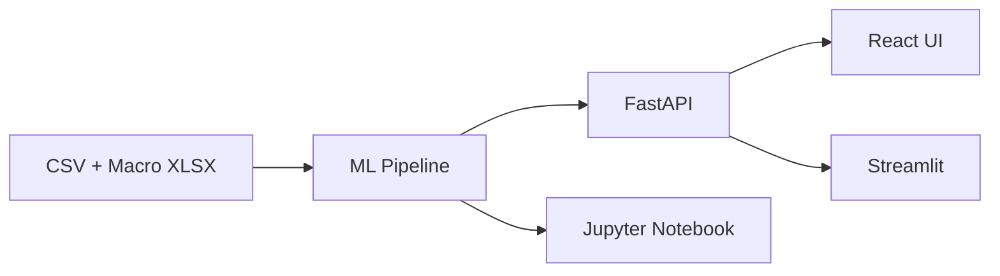

# Credit Risk PD & Stress Testing Engine

Full-stack credit risk application for **Probability of Default (PD)** modeling, macroeconomic **stress testing**, and regulatory **Expected Credit Loss (ECL)** calculations.

## Architecture

```text
data/                  # Credit CSV + macro stress Excel
ML/                    # Core ML pipeline (features, train, predict, scoring)
backend/               # FastAPI REST API
frontend/              # React + Vite dashboard
streamlit_app/         # Streamlit alternative UI
docs/notebooks/        # Full model evaluation notebook
infra/                 # Docker Compose (optional)
```



## Features

- **PD Models**: Logistic Regression + XGBoost with shared feature engineering
- **Stress Testing**: Normal / Boom / Recession macro scenarios with PD shocks
- **Risk Scoring**: PD → scorecard (300–850), risk bands, EL = PD × LGD × EAD
- **Regulatory (MVP)**:
  - **Basel IRB**: EL = PD × LGD × EAD
  - **IFRS 9**: 3-stage ECL (simplified staging rules)
  - **CECL**: lifetime ECL proxy for Stage 2/3

> **Disclaimer**: Educational MVP — not for production regulatory submission.

## Datasets

| File | Description |
|------|-------------|
| `data/credit_risk_dataset_new.csv` | Loan-level data, target: `loan_status` (0/1) |
| `data/US_Macro_Economic_Stress_Test_Data.xlsx` | Macro scenarios: Normal, Boom, Recession |

Macro Excel schema (per sheet):

| Column | Description |
|--------|-------------|
| `variable` | e.g. unemployment_rate, gdp_growth |
| `base_value` | Baseline macro value |
| `stressed_value` | Scenario value |
| `pd_multiplier` | PD shock multiplier |

## Setup

### Prerequisites

- Python 3.10+
- Node.js 18+ (for React frontend)

### 1. Clone and configure

```bash
cd "CR, POD & ST"
python -m venv .venv

# Windows PowerShell
.\.venv\Scripts\Activate.ps1

# macOS/Linux
source .venv/bin/activate

pip install -r requirements.txt
copy .env.example .env
```

### 2. Generate macro data (if missing)

```bash
python scripts/generate_macro_data.py
```

### 3. Train models

```bash
python -m ML.train
# or via API after starting backend: POST http://localhost:8000/train
```

Artifacts saved to `backend/models/`.

## Running the Application

### FastAPI Backend

```bash
uvicorn backend.main:app --reload --host 0.0.0.0 --port 8000
```

API docs: http://localhost:8000/docs

| Endpoint | Method | Description |
|----------|--------|-------------|
| `/health` | GET | Health check + model status |
| `/train` | POST | Train LR & XGBoost models |
| `/metrics` | GET | Model metrics + feature importance |
| `/predict` | POST | Single or batch PD prediction |
| `/stress_test` | POST | Portfolio stress test |

### React Frontend

```bash
cd frontend
npm install
npm run dev
```

Open http://localhost:5173 (set `VITE_API_URL` in `frontend/.env` if needed).

### Streamlit UI

```bash
streamlit run streamlit_app/app.py
```

### Jupyter Notebook

```bash
jupyter notebook docs/notebooks/credit_risk_model_full_evaluation.ipynb
```

The notebook covers: EDA, cleaning, feature engineering, LR & XGB training, all metrics (ROC AUC, F1, precision, recall, accuracy, KS, Gini), confusion matrix, feature importance, lift charts, and stress test examples.

### Docker (optional)

```bash
docker compose -f infra/docker-compose.yml up --build
```

## Feature Engineering

- `log1p(person_income)` — income transform
- DTI via `loan_percent_income` and `loan_amnt / person_income`
- Age and income buckets
- Outlier caps: `person_age` [18, 100], `person_emp_length` [0, 50]
- Missing value imputation (median / mode)
- One-hot encoding for categoricals

## Environment Variables

See [`.env.example`](.env.example):

| Variable | Default |
|----------|---------|
| `DATA_CSV_PATH` | `data/credit_risk_dataset_new.csv` |
| `MACRO_XLSX_PATH` | `data/US_Macro_Economic_Stress_Test_Data.xlsx` |
| `MODEL_DIR` | `backend/models` |
| `DEFAULT_LGD` | `0.45` |

## Conventional Commits

Use [Conventional Commits](https://www.conventionalcommits.org/) for git history:

| Prefix | Use |
|--------|-----|
| `feat:` | New feature |
| `fix:` | Bug fix |
| `docs:` | Documentation |
| `refactor:` | Code refactor |
| `chore:` | Tooling, deps |

Examples:

```text
feat(ml): add XGBoost training pipeline
fix(api): handle missing model artifacts on predict
docs: add stress test usage to README
```

## License

MIT (educational use)
